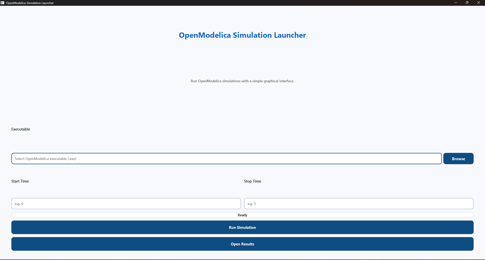
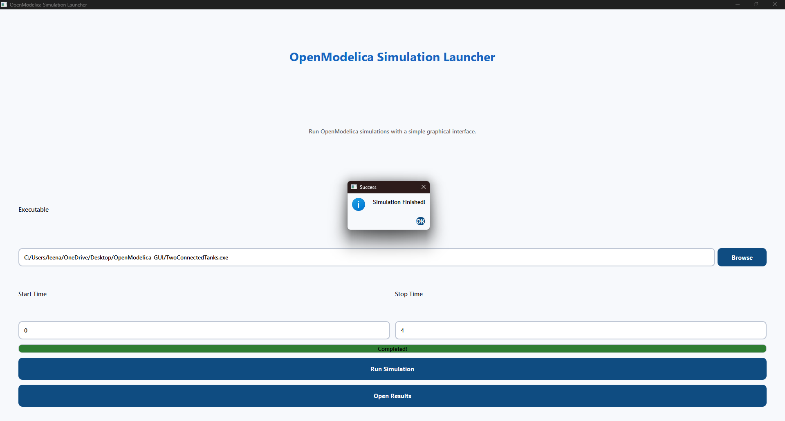

# OpenModelica Simulation Launcher


A modern desktop application built with **Python** and **PyQt6** to launch and monitor OpenModelica simulation executables through an intuitive graphical user interface.

---

## Overview

The OpenModelica Simulation Launcher simplifies running OpenModelica simulation executables by providing a clean and user-friendly desktop interface.

Users can:

- Browse and select an OpenModelica executable (.exe)
- Configure simulation start time
- Configure simulation stop time
- Execute simulations directly from the GUI
- Monitor execution using a progress bar
- Open the generated results folder after completion

---

## Technologies Used

- Python 3
- PyQt6
- OpenModelica
- Windows 10/11

---

## Features

- Modern graphical interface
- Browse executable files
- Start Time input
- Stop Time input
- One-click simulation execution
- Progress tracking
- Automatic success notification
- Open Results folder button

---

## Folder Structure

```text
OpenModelica_GUI/
│
├── main.py
├── requirements.txt
├── README.md
├── images/
│   ├── main-window.png
│   └── simulation-completed.png
│
├── TwoConnectedTanks.exe
├── libSimulationRuntimeC.dll
└── Generated OpenModelica files
```

---

## Installation

Clone the repository

```bash
git clone https://github.com/diyalatesh/OpenModelica-Simulation-Launcher.git
```

Install dependencies

```bash
pip install -r requirements.txt
```

---

## Running the Application

```bash
python main.py
```

### Steps

1. Click **Browse**
2. Select the OpenModelica executable
3. Enter Start Time
4. Enter Stop Time
5. Click **Run Simulation**
6. Wait until execution completes
7. Click **Open Results** to view generated files

---

# Application Preview

## Main Window

<p align="center">

</p>

---

## Simulation Completed

<p align="center">

</p>

---

## Application Workflow

```text
Select Executable
        │
        ▼
Enter Start Time
        │
        ▼
Enter Stop Time
        │
        ▼
Run Simulation
        │
        ▼
Execute OpenModelica Model
        │
        ▼
Generate Result Files
        │
        ▼
Open Results Folder
```

---

## Object-Oriented Design

The project follows Object-Oriented Programming principles.

- MainWindow class manages the complete GUI
- Separate methods for browsing files
- Independent simulation execution method
- Dedicated progress handling
- Modular design for future expansion

---

## Future Enhancements

- Multiple simulation support
- Export results to CSV
- Built-in graph visualization
- Dark mode
- Save previous simulation configurations
- Improved settings panel

---

## Author

**Diya Latesh**

First-Year Computer Science Engineering Student

