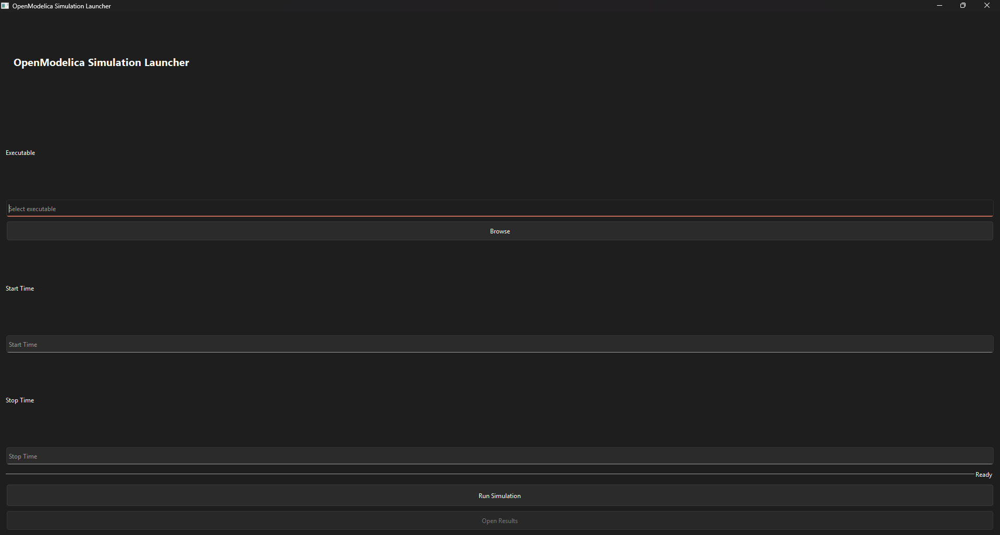
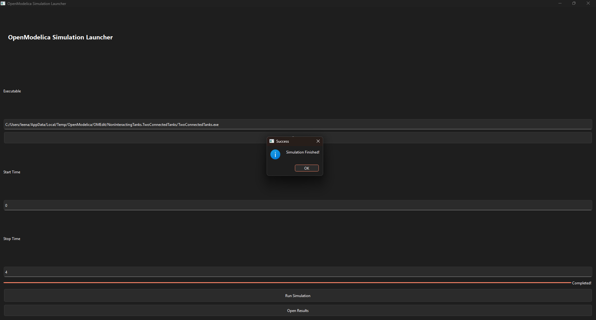

# OpenModelica Simulation Launcher

## Overview

This project is a desktop application developed using Python and PyQt6 to execute OpenModelica simulation executables.

The application allows the user to:

- Browse and select an OpenModelica executable
- Enter simulation start time
- Enter simulation stop time
- Execute the simulation
- View execution progress using a progress bar
- Open the simulation results folder after execution

---

## Technologies Used

- Python 3
- PyQt6
- OpenModelica
- Windows 10/11

---

## Features

- Browse for executable (.exe)
- Start Time input
- Stop Time input
- Run Simulation button
- Progress bar
- Success message after execution
- Open Results button
- Clean and user-friendly interface

---

## Folder Structure

```
OpenModelica_GUI/
│
├── main.py
├── README.md
├── requirements.txt
├── TwoConnectedTanks.exe
├── libSimulationRuntimeC.dll
├── TwoConnectedTanks_res.mat
└── Other generated OpenModelica files
```

---

## Installation

Install the required package:

```bash
pip install -r requirements.txt
```

---

## Running the Application

Run the application using:

```bash
python main.py
```

1. Click **Browse** and select the OpenModelica executable.
2. Enter Start Time.
3. Enter Stop Time.
4. Click **Run Simulation**.
5. After completion, click **Open Results** to view the output files.

---

## Example

Start Time: 0

Stop Time: 4

Simulation executes successfully and generates the result files.

---
## Application Preview

### Main Window



### Simulation Completed



---
## Future Enhancements

- Support multiple OpenModelica simulation models.
- Allow exporting simulation results to CSV.
- Display simulation graphs directly inside the application.
- Save previously used simulation configurations.
- Improve UI with themes and icons.

---
## Object-Oriented Design

The application follows Object-Oriented Programming principles.

- `MainWindow` class manages the complete GUI.
- Methods are separated for browsing files, executing simulations, opening results, and updating progress.
- The design makes the application modular and easy to extend.
  
---
## Application Workflow

1. Select an OpenModelica executable.
2. Enter the simulation start time.
3. Enter the simulation stop time.
4. Click **Run Simulation**.
5. Wait for execution to finish.
6. Open the generated results folder.

---
## Author

Diya Latesh
